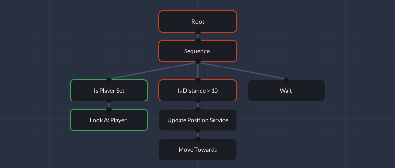

# MonoBehaviourTree — Simple behaviour tree for Unity
<p align="center">
  
</p>
This project is simple event driven behaviour tree based on Unity engine component system. This asset comes with minimal node library and tree visual editor.

**Important:** This is not fully fledged visual scripting tool. Package has its own visual editor, however requires you to implement your own nodes.

## Contribute
Contribution in any form is very welcome. Bugs, feature requests or feedback can be reported in form of Issues.

## Getting started
The latest version can be installed via [package manager](https://docs.unity3d.com/Manual/upm-ui-giturl.html) using following git URL:<br> ```https://github.com/Qriva/MonoBehaviourTree.git#upm``` 
<br>Alternatively you can copy the `Assets/MonoBehaviourTree` folder to your project or download from [Unity Asset Store](https://assetstore.unity.com/packages/slug/213452).

Examples of usage are available in package manager or in folder **Samples** containing demo scenes. If you copy assets manually you might want to delete `Samples` directory to get rid of redundant files.

This documentation assumes you have basic knowledge about behaviour trees. If you don't have it, you should check some online resources like this 
[Game Developer article](https://www.gamedeveloper.com/programming/behavior-trees-for-ai-how-they-work)
or [Unreal Engine documentation](https://docs.unrealengine.com/en-US/Engine/ArtificialIntelligence/BehaviorTrees/BehaviorTreesOverview/index.html).

## Event Driven Behaviour Tree Overview
Standard behaviour tree design assumes three types of nodes: composites, decorators and leafs. Composites are used to define the flow in the tree, decorators can modify node results and leafs perform tasks or check conditions. This design has one major flaw - tree must be traversed from the beginning every single tick, otherwise it will not be possible to react to changes in state or data. Event driven tree is the fix to that problem. When tree gets update it continues from the last executed running node. Normally it would mean, that executed higher priority nodes will not be reevaluated immediately, but event driven BT introduces **abort system** to give possibility to reset tree to previous state, when certain event occur. Implementation used in this project is very similar to the one used in Unreal engine - leaf nodes are not used as conditions, instead they are in form of decorators. Additionally it is possible to create Service nodes which can perform task periodically.

### Node Abort
When the tree is updated, the first evaluated thing are aborting nodes. If there is any aborting node, the tree will be reset to that position and execution will be continued from this node.
In case there are multiple aborting nodes, the one closest to root will be selected.
There are four abort types:
- **None** - don't do anything when change occurs
- **Self** - abort children running below
- **Lower Priority** - abort running nodes with lower priority (nodes to the right)
- **Both** - abort self and lower priority nodes

>Execution order (priority) of nodes with common ancestor is defined by position on X axis, nodes to the left has higher priority.

Aborts can be performed only by ```Decorator``` nodes. See example abort implementation in [Decorator](#custom-decorator--condition) section.

## Basic Usage
The main core of behaviour tree is **MonoBehaviourTree** component. It contains most of tree state during runtime. It is important to note, that tree does not run automatically and must be updated by other script. This design gives you possibility to tick the tree in Update, FixedUpdate or custom interval. However, most of the time Update event will be used, so you can use component **MBT Executor** to do that.

In most of cases you will need some place to store shared data for nodes. You could implement your own component to do that, but instead it's better to use built in **Blackboard** component. Blackboard allows you to create observable variables of predefined types that are compatible with default nodes.

## Node editor
To open tree editor window click "Open editor" button of MonoBehaviourTree component or click Unity menu: Window / Mono Behaviour Tree. In visual editor you can create, connect, delete and setup nodes. 

Every behaviour tree needs an entry point called **Root**. To add it right click on empty canvas to open node popup, then select Root. Execution of BT starts here and goes from top to down, left to right.

> **Implementation note:** All nodes and variables are in fact components, but they are invisible in inspector window.
> It is recommended to use separate empty game object to build the tree - this make it easier to create prefabs and avoid unnecessary unknown problems.

Most of nodes has additional properties that you can change. To do this select the node and list of options will show up in **MonoBehaviourTree component inspector** section (standard component inspector). When node setup is not valid, error icon will be shown next to the node. By default error is displayed if one of variable references is set to "None". You can create custom validation rules in your own nodes, see [Node API section](#node-api).

### Editor Window Features
Right click on empty space to create new node. To connect nodes click on in/out handler (black dot on top and bottom of node), then drag and drop it above another node. In case node cannot have more than one child (decorator) the connection will be overridden by the new one.
To delete, duplicate or disconnect nodes right click on node to open context menu and select the appropriate option.
Use left mouse button to drag workspace or nodes. You can drag whole branch of nodes when CTRL key is pressed.

## Component Reference

### MonoBehaviourTree component
Main component used as hub of behaviour tree.

**Properties**
- **Description** - optional user description.
- **Repeat OnFinish** - whether the tree should be executed again when finished.
- **Max Executions Per Tick** - how many nodes should be executed during single update.
- **Parent** - parent reference if this tree is subtree. Read more in [Subtree node section](#subtree).

**Node Inspector** - Inspector of node selected in Behaviour Tree editor window.

### Blackboard component
Component used to provide and manage observable variables.
To add variable fill the **Key** text field, select it's type and press "Add" button. Key is used as identifier to get or set variable value, this can be done by VariableReference or blackboard method: ```public T GetVariable<T>(string key)```.
Blackboard component displays all available variables in list and allows to set initial value for each of them.
> **Implementation note:** Changing blackboard variables during playmode triggers change listeners, however old and new value  will be the same in this event, because it's called from  `OnValidate`. Displayed values are refreshed every half second.

**Built In variable types:** Bool, Float, Int, Object, Quaternion, String, Transform, Vector2, Vector3. If you need to add your own custom type read [Custom Variable section](#custom-variable).

**Master Blackboard** option allows to make synchronisation effect between variables. When set, blackboard will replace variables during initialization, but only when their keys match. Replacement is not hierarhical and only variables from given parent blackboard are matched. It is recommended to create one master blackboard on top of the tree and keep all other subtrees blackboards synchronized with the top one.

## Variables and Events
In most of situations nodes need to share some state data between each other, it can be done by Blackboard, Variable and VariableReference system. Variables are observale data containers, that can be accesed via Blackboard. To get variable you need to know its key, but inputting key manually to every node is not handy and very error prone. 

To avoid this you can use helper class VariableReference. 
This class allows you to automaticaly get and cache reference to blackboard variable.
VariableReference has also constant value mode in case you don't need to retrive values from blackboard. You can toggle VarRef mode in editor by clicking small button to the left. Keys displayed in dropdown will be loaded from blackboard on the same object or if there is none it will look upwards the hierarchy to find one.
```csharp
// Get variable from blackboard by key
FloatVariable floatVar = blackboard.GetVariable<FloatVariable>("myKey");

// Attach listener to variable
floatVar.AddListener(MyVariableChangeListener);

// Create float reference property with default constant value
public FloatReference floatRef = new FloatReference(1f);

// Create int reference, but do not allow constant values
public IntReference intRef = new IntReference(VarRefMode.DisableConstant);

// Check if its in constant or reference mode
bool constant = floatRef.isConstant;

// Attach listener to variable reference
if (!constant)
{
    // GetVariable will return null if floatRef is constant
    floatRef.GetVariable().AddListener(MyVariableChangeListener);
}

// Get or set value of variable reference
floatRef.Value = 1.5f;
float value = floatRef.Value;
```
> **Important:** TransformVariable change listener will be called only when reference to object changes. Position or rotation changes do not trigger change listener.

### Custom Variable
If built in variables are not enough, you can create your own.
To create new Variable and VariableReference you must extend Variable class and VariableReference class. Variable inheriths MonoBehaviour, so to work properly it must by placed in file of the same name as your custom type. VariableReference is normal serializable class and can be placed in the same file. Add ```[AddComponentMenu("")]``` attribute to disallow adding variable component manually. 

Any variable must implement ValueEquals method which is used to detect change of value. This mechanism allows to correctly compare Unity objects in generic class, avoid boxing, plus gives the way to implement your own change detection logic when needed.
```csharp
[AddComponentMenu("")]
public class CustomVariable : Variable<CustomType>
{
    protected override bool ValueEquals(CustomType val1, CustomType val2)
    {
        return val1 == val2;
    }
}

[System.Serializable]
public class CustomReference : VariableReference<CustomVariable, CustomType>
{
    // You can create additional constructors and Value getter/setter
    // See FloatVariable.cs as example

    // If your variable is reference type you might want constant validation
    // protected override bool isConstantValid
    // {
    //     get { return constantValue != null; }
    // }
}
```

## Node Reference

### Root
Entry node of behaviour tree.
### Sequence
Executes children from left to right as long as each subsequent child returns success. Returns success when all children succeeded. Failure if one of them failed. When Random option is enabled, then execution goes in random order.
### Selector
Executes children from left to right until one of them return failure. Returns success if any children succeed. Failure if all of them failed. When Random option is enabled, then execution goes in random order.
### Is Set Condition
Checks if blackboard variable is set. Node supports Bollean, Object and Transform variables. Selecting Invert option will produce "If not set" effect.
### Number Condition
Checks if blackboard number variable meets requirement. Node supports Float and Int variables.
### Distance Condition
Checks distance between two transforms and returns success when given distance condition is met.
### Cooldown
Blocks execition until the specified amount of time has elapsed.
Time starts counting after branch is exited. If abort is enabled, the execution will be moved back to this node after time has elapsed.
### Inverter
Inverts node result. Failure becomes Success and vice versa.
### Invoke Unity Event
Triggers Unity Event with one parameter of selected type
### Random Chance
There is fixed chance that node will be executed. Returns Failure if roll is not favorable.
### Repeat Until Fail
Repeats branch as long as Success is returned from the child.
### Repeater
Repeats branch specified amount of times or infinitely.
### Set Boolean
Sets blackboard bool variable
### Set Number
Sets blackboard int or float variable
### Set Object
Sets blackboard Transform or GameObject variable
### Set Vector
Sets blackboard Vector3 or Vector2 variable
### Succeeder
Always returns Success.
### Time Limit
Determines how long branch can be executed. After given time elapses branch is aborted and Failure is returned.
### Calculate Distance Service
Calculates distance between two transforms and updates blackboard float variable with the result.
### Update Position Service
Updates blackboard Vector3 variable with position of given source transform.
### Set Number
Sets blackboard Float or Int variable.
### Wait
Waits specific amount of time, then returns Success.
### Subtree
Subtree node allows connection of other behaviour tree as child, this gives you possibility to create reusable blocks of nodes. Such a tree must be created in separate game object and attached as children. Child tree is updated by its parent. **Parent of subtree must be specified in MonoBehaviourTree component to work properly.** 

## Creating custom nodes
It is possible to create custom nodes by extending one of base classes provided by library. Each node **must** be in separate file with the name corresponding to class name. MBTNode attribute is required to register node in editor finder, it accepts two parameters: name and order. Name allows use of up to one folder, so "Custom Node" and "Example/Custom Node" is valid, but "Fruits/Bananas/Custom Node" is not.
Order parameter is used to position node higher in finder. Nodes are sorted first by order and then by name. Default order is 1000 and lower values get higher priority. For example Selector, Sequence, Root and SubTree nodes have following values: 100, 150, 200, 250.

### Node API
There are several event methods that can be implemented to control Node execution flow, but the only required one is ```Execute``` used to return state when node is running. 
```OnEnter``` and ```OnExit``` primary function is to setup before or cleanup after execution.
```OnAllowInterrupt``` and ```OnDisallowInterrupt``` can be used to detect when its allowed to abort or listen to some events. 
Additionally there is ```IsValid``` method used in editor window to determine if Node setup is correct. By default it uses reflection to find variable references with empty keys and in most of cases there is no need to override this method, unless you want to include other fields during validation or custom setup requires it.

### Execution Flow
During runtime node can be in one of following states:
- **Ready** - Default state 
- **Running** - Node is currently executed or one of its successors
- **Success** - Node finished execution and returned success
- **Failure** - Node finished execution and returned failure

When node is ready and parent decide to "enter" the node, then ```OnAllowInterrupt``` and ```OnEnter``` is called. After that ```Execute``` method is called which always must return some state. 
If running state is returned, then execution will be paused and resumed in next tick, but if running with children node is returned, then execution is "passed down" and continued in that node. 
When success or failure is returned, then this result is passed to the parent and ```OnExit``` is called. ```OnDisallowInterrupt``` is not called until the cycle ends or tree is aborted to higher priority node.

### Custom Leaf
Leaf nodes are used to do designated task. It can be something simple as setting variable or very complex like enemy navigation along the path.
```csharp
using UnityEngine;
using MBT;

// Empty Menu attribute prevents Node to show up in "Add Component" menu.
[AddComponentMenu("")]
// Register node in visual editor node finder
[MBTNode(name = "Example/Custom Task")]
public class CustomTask : Leaf
{
    public BoolReference somePropertyRef = new BoolReference();
    
    // These two methods are optional, override only when needed
    // public override void OnAllowInterrupt() {}
    // public override void OnEnter() {}

    // This is called every tick as long as node is executed
    public override NodeResult Execute()
    {
        if (somePropertyRef.Value == true)
        {
            return NodeResult.success;
        }
        return NodeResult.failure;
    }

    // These two methods are optional, override only when needed
    // public override void OnExit() {}
    // public override void OnDisallowInterrupt() {}

    // Usually there is no needed to override this method
    public override bool IsValid()
    {
        // You can do some custom validation here
        return !somePropertyRef.isInvalid;
    }
}
```
### Custom Decorator / Condition
Decorator nodes are mainy used to change flow of the tree. It has single child and must always return either success or failure. You can implement your own subclass by implementing ```Decorator``` class, however in most of cases you might want to create condition - in such a case use ```Condition``` subclass. Implement condition evaluation in ```Check()``` method and node will return success if condition is met.

If you need to implement abort system in your condition node, then below you can find a simple example.
```csharp
[AddComponentMenu("")]
[MBTNode(name = "Example/Custom Condition")]
public class CustomCondition : Condition
{
    public Abort abort;
    public BoolReference somePropertyRef = new BoolReference(VarRefMode.DisableConstant);

    public override bool Check()
    {
        // Evaluate your custom condition
        return somePropertyRef.Value == true;
    }

    public override void OnAllowInterrupt()
    {
        // Do not listen any changes if abort is disabled
        if (abort != Abort.None)
        {
            // This method cache current tree state used later by abort system
            ObtainTreeSnapshot();
            // If somePropertyRef is constant, then null exception will be thrown.
            // Use somePropertyRef.isConstant in case you need constant enabled.
            // Constant variable is disabled here, so it is safe to do this.
            somePropertyRef.GetVariable().AddListener(OnVariableChange);
        }
    }

    public override void OnDisallowInterrupt()
    {
        if (abort != Abort.None)
        {
            // Remove listener
            somePropertyRef.GetVariable().RemoveListener(OnVariableChange);
        }
    }

    private void OnVariableChange(bool oldValue, bool newValue)
    {
        // Reevaluate Check() and abort tree when needed
        EvaluateConditionAndTryAbort(abort);
    }
}
```
### Custom Service
Service is a special decorator that performs the task as long as its branch is executed. This way you can periodically execute some task needed only by the ancestors. Additionally you can fully encapsulate your system into single behaviour tree without need of external scripts running on other game objects.

```csharp
[AddComponentMenu("")]
[MBTNode("Example/Custom Service")]
public class CustomService : Service
{
    public Vector3Reference position = new Vector3Reference(VarRefMode.DisableConstant);

    public override void Task()
    {
        // Reset variable to zero every X amount of time
        position.Value = Vector3.zero;
    }
}
```

## Debugging
During playmode you can preview tree execution flow in editor window. Nodes are marked with the appropriate color corresponding to their state:
- Ready - none (default)
- Success - green
- Failure - orange
- Running - purple

When the node is invalid, an error icon will be displayed in the upper right corner. You should not run the tree when there are any errors in connected nodes.

Except that, you can set breakpoints on multiple nodes. Breakpoint will stop execution and pause play mode after node is entered, but before it get executed. Nodes with breakpoint enabled will have red node names.

## Known Issues
- All nodes should be removed before deleting their script. When the missing script is restored and children of this node were connected to other parent, it will break the tree. Additionaly nodes with missing script remain hidden in the inspector and it is hard to remove them.
- When tree is turned into prefab, all their instances should not change connections between nodes. Sometimes connections are desynchronized and the tree does not work properly.